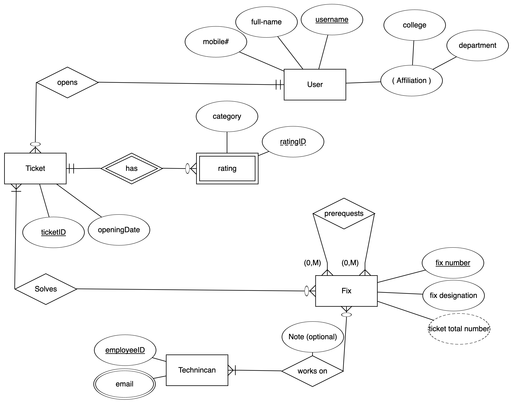

# IS230 Tutorial – Project Part I

ER design and implementation

## Project information
### Student
**Name:** Nasser Alowaymir

**ID:** 445102817

### Table of contents
1. [Project Information](#project-information)  
   1.1 [Student Information](#student)  
   1.2 [Project Introduction](#project-introduction)  
   1.3 [Project Requirements](#project-requirments)  
   1.4 [Project Description](#project-describtion)  
   1.5 [Project instructiuons](#project-instructions)  
3. [Project Implementation](#project-implementaion)  
   2.1 [Entity-Relationship Diagram (ERD)](#1-er)  
   2.2 [MySQL Workbench Relational Model](#2-mysql-workbench)  
   2.3 [SQL Script to Generate the Database](#3-sql-script-to-generate-the-database)  

### Project introduction
This project is for making a ERD, relational model, and export it as sql commands according to the requirments given below.
### Project requirments


<br/>

> [!WARNING]
> تنبيهات مهمة لا يعذر الطالب بعدم أخذها بعين الاعتبار مهما كان السبب:
> 1.	أي تشابه في المشاريع, و لو جزئي, يعرض الطالب لرصد صفر كدرجة للمشروع و تقرير لدكتور المادة مع إمكانية رفع التقرير لرئيس القسم.
> 2.	يتم تسليم تقرير المشروع على الـ Blackboard.
>  -	المشاريع المسلمة عن طريق البريد أو البريد الإلكتروني لن تقبل.
>3.	عدم التقيد بمتطلبات التقرير (المذكورة في قالب تقرير المشروع (Project Report Template)) سوف يعرض الطالب لخصم درجات.


</br>

---
#### Project describtion 
****ERD Notes** [^1]

The KSU Helpdesk Unit needs to design a database to follow up on technical support provided to its users (employees, faculties, students, etc.) facing any kind of problems during their work. The following information is needed to keep track of users: the username (identifier), their full-name, a mobile number, and their affiliation.<mark>Affiliation consists</mark>[^1] of: the college and the department to which the user is affiliated. To request help from the unit, a user may open **one or several** tickets. A ticket is uniquely described by a ticket ID and needs to record the opening date. A ticket is opened by **one and only one** *user*. Afterwards a ticket is resolved by <mark>**one** *Fix* **or many**</mark>[^2] Fixes. A Fix number uniquely identifies a Fix; and a Fix also has a Fix designation and a <mark>**ticket total** number</mark>[^3] (representing the number of tickets resolved by that Fix). A Fix may resolve **one or more** *tickets*. The database also stores the technicians who work at the help desk. Each technician is defined by their employee ID and we also record their email addresses, which might be **more than one**. A technician may work **on one or more** *Fixes*; a Fix must have **at least one** technician working on it. Note that each technician may leave a comment on a Fix they worked on. A <mark>Fix may have prerequisites</mark>[^4] (i.e. it requires other Fixes to be finished first). <mark>Finally, at the closure of a ticket, a ticket rating is conducted. A ticket rating has a category and is identified by a rating ID, though a ticket may have any number of ratings, the **rating ID always starts from 1 for each ticket**.</mark>[^5]

<br/>


[^1]: I assumed that it is jus a composite attribute, since is hasn’t any relations to other entities, and can vary between users.

[^2]: Since a ticket may hasn’t been solved yet, so it could exist without a Fix made for it. Then I am going to make it optional.

[^3]: I made it Derived, since it came from the relation between Fix and Ticket

[^4]: Single fix is prerequest 0 or multiple fixs, and a fix is prerequested for multiple fix.
  This makes a many to many relation, with fix that prerequests another fixs means 2 fixs must choosen, but when no prerequest wanted then no any fixs choosen in this relation. I have no idea how to implement this in ERD, so I made it very detailed with text in the diagram.
[^5]: Since the rating is only identified using its ID (which may repeat through multiple tickets) with the ticket ID associated with it; then it will be a weak entity. and since a ticket can have many rating, I assumed it can also have no rating if the user didn’t added the rating. and a rating must be assosiated with a single ticket since it is weak entity. then: the relation will be one and only one ticket has zero or may ratings.

#### Project instructions
1. Use the report template to submit the group’s work and complete each of the required sections carefully to not lose marks. 
  -	Section#1 is the ER resulting from the above project statement. you can draw it by hand or use any drawing software (SUGGESTION: use https://erdplus.com/)
  - Section#2 is to adapt the resulting ER from section#1 to be drawn using MySQL Workbench.
  - Section#3 is exporting the SQL script to generate a database.
2. Use the MySQL Workbench tool to draw the requested ER diagram in Section#2 taking into account the following:
  a)	Choose a convenient domain for each attribute (like INT for integers, FLOAT for fractions or VARCHAR for strings).
  b)	Specify key attributes for each entity type as well as cardinality ratio and participation constraints for each relationship type.
3. The group report should be uploaded to the blackboard by the group leader ONLY.

## Project Implementaion


Here I am impelenting my database design according to the requirements.

### 1. ER


### 2. MySQL workbench


### 3. SQL script to generate the Database
```sql
-- MySQL Script generated by MySQL Workbench
-- Sat Mar  8 23:11:02 2025
-- Model: New Model    Version: 1.0
-- MySQL Workbench Forward Engineering

SET @OLD_UNIQUE_CHECKS=@@UNIQUE_CHECKS, UNIQUE_CHECKS=0;
SET @OLD_FOREIGN_KEY_CHECKS=@@FOREIGN_KEY_CHECKS, FOREIGN_KEY_CHECKS=0;
SET @OLD_SQL_MODE=@@SQL_MODE, SQL_MODE='ONLY_FULL_GROUP_BY,STRICT_TRANS_TABLES,NO_ZERO_IN_DATE,NO_ZERO_DATE,ERROR_FOR_DIVISION_BY_ZERO,NO_ENGINE_SUBSTITUTION';

-- -----------------------------------------------------
-- Schema KSU_Helpdesk
-- -----------------------------------------------------

-- -----------------------------------------------------
-- Schema KSU_Helpdesk
-- -----------------------------------------------------
CREATE SCHEMA IF NOT EXISTS `KSU_Helpdesk` DEFAULT CHARACTER SET utf8 ;
USE `KSU_Helpdesk` ;

-- -----------------------------------------------------
-- Table `KSU_Helpdesk`.`User`
-- -----------------------------------------------------
CREATE TABLE IF NOT EXISTS `KSU_Helpdesk`.`User` (
  `username` VARCHAR(50) CHARACTER SET 'DEFAULT' NOT NULL,
  `fullname` VARCHAR(100) NOT NULL,
  `mobileNumber` INT NOT NULL,
  `college` VARCHAR(50) NOT NULL,
  `depart` VARCHAR(50) NOT NULL,
  PRIMARY KEY (`username`),
  UNIQUE INDEX `username_UNIQUE` (`username` ASC) VISIBLE)
ENGINE = InnoDB;


-- -----------------------------------------------------
-- Table `KSU_Helpdesk`.`Ticket`
-- -----------------------------------------------------
CREATE TABLE IF NOT EXISTS `KSU_Helpdesk`.`Ticket` (
  `TicketID` VARCHAR(50) NOT NULL COMMENT 'primary key, and not null, also it should be unique.\nVarchar(50) because the ticket may have an ID as Ticket000 or T000 or any other forms that contains letters',
  `opening_date` DATETIME NOT NULL,
  `User_username` VARCHAR(50) CHARACTER SET 'DEFAULT' NOT NULL,
  PRIMARY KEY (`TicketID`),
  UNIQUE INDEX `TicketID_UNIQUE` (`TicketID` ASC) VISIBLE,
  INDEX `fk_Ticket_User1_idx` (`User_username` ASC) VISIBLE,
  CONSTRAINT `fk_Ticket_User1`
    FOREIGN KEY (`User_username`)
    REFERENCES `KSU_Helpdesk`.`User` (`username`)
    ON DELETE NO ACTION
    ON UPDATE NO ACTION)
ENGINE = InnoDB;


-- -----------------------------------------------------
-- Table `KSU_Helpdesk`.`Rating`
-- -----------------------------------------------------
CREATE TABLE IF NOT EXISTS `KSU_Helpdesk`.`Rating` (
  `ratingID` VARCHAR(50) NOT NULL,
  `TicketID` VARCHAR(50) NOT NULL,
  `category` VARCHAR(100) NOT NULL,
  PRIMARY KEY (`ratingID`, `TicketID`),
  INDEX `fk_Rating_Ticket_idx` (`TicketID` ASC) VISIBLE,
  CONSTRAINT `fk_Rating_Ticket`
    FOREIGN KEY (`TicketID`)
    REFERENCES `KSU_Helpdesk`.`Ticket` (`TicketID`)
    ON DELETE NO ACTION
    ON UPDATE NO ACTION)
ENGINE = InnoDB;


-- -----------------------------------------------------
-- Table `KSU_Helpdesk`.`Fix`
-- -----------------------------------------------------
CREATE TABLE IF NOT EXISTS `KSU_Helpdesk`.`Fix` (
  `fix_num` INT NOT NULL,
  `fix_des` VARCHAR(100) NOT NULL,
  `TicketsAmount` INT GENERATED ALWAYS AS (),
  PRIMARY KEY (`fix_num`),
  UNIQUE INDEX `fix_num_UNIQUE` (`fix_num` ASC) VISIBLE)
ENGINE = InnoDB;


-- -----------------------------------------------------
-- Table `KSU_Helpdesk`.`Technican`
-- -----------------------------------------------------
CREATE TABLE IF NOT EXISTS `KSU_Helpdesk`.`Technican` (
  `employeeID` VARCHAR(50) NOT NULL,
  PRIMARY KEY (`employeeID`),
  UNIQUE INDEX `employeeID_UNIQUE` (`employeeID` ASC) VISIBLE)
ENGINE = InnoDB;


-- -----------------------------------------------------
-- Table `KSU_Helpdesk`.`Fix_prereq_Fix`
-- -----------------------------------------------------
CREATE TABLE IF NOT EXISTS `KSU_Helpdesk`.`Fix_prereq_Fix` (
  `fix_num` INT NOT NULL,
  `prereq_fix` INT NOT NULL,
  INDEX `fk_Fix_has_Fix_Fix2_idx` (`prereq_fix` ASC) VISIBLE,
  INDEX `fk_Fix_has_Fix_Fix1_idx` (`fix_num` ASC) VISIBLE,
  PRIMARY KEY (`fix_num`, `prereq_fix`),
  CONSTRAINT `fk_Fix_has_Fix_Fix1`
    FOREIGN KEY (`fix_num`)
    REFERENCES `KSU_Helpdesk`.`Fix` (`fix_num`)
    ON DELETE NO ACTION
    ON UPDATE NO ACTION,
  CONSTRAINT `fk_Fix_has_Fix_Fix2`
    FOREIGN KEY (`prereq_fix`)
    REFERENCES `KSU_Helpdesk`.`Fix` (`fix_num`)
    ON DELETE NO ACTION
    ON UPDATE NO ACTION)
ENGINE = InnoDB;


-- -----------------------------------------------------
-- Table `KSU_Helpdesk`.`Fix_solve_Ticket`
-- -----------------------------------------------------
CREATE TABLE IF NOT EXISTS `KSU_Helpdesk`.`Fix_solve_Ticket` (
  `Ticket_TicketID` VARCHAR(50) NOT NULL,
  `Fix_fix_num` INT NOT NULL,
  PRIMARY KEY (`Ticket_TicketID`, `Fix_fix_num`),
  INDEX `fk_Ticket_has_Fix_Fix1_idx` (`Fix_fix_num` ASC) VISIBLE,
  INDEX `fk_Ticket_has_Fix_Ticket1_idx` (`Ticket_TicketID` ASC) VISIBLE,
  CONSTRAINT `fk_Ticket_has_Fix_Ticket1`
    FOREIGN KEY (`Ticket_TicketID`)
    REFERENCES `KSU_Helpdesk`.`Ticket` (`TicketID`)
    ON DELETE NO ACTION
    ON UPDATE NO ACTION,
  CONSTRAINT `fk_Ticket_has_Fix_Fix1`
    FOREIGN KEY (`Fix_fix_num`)
    REFERENCES `KSU_Helpdesk`.`Fix` (`fix_num`)
    ON DELETE NO ACTION
    ON UPDATE NO ACTION)
ENGINE = InnoDB;


-- -----------------------------------------------------
-- Table `KSU_Helpdesk`.`technican_emails`
-- -----------------------------------------------------
CREATE TABLE IF NOT EXISTS `KSU_Helpdesk`.`technican_emails` (
  `email` VARCHAR(50) NOT NULL,
  `Technican_eID` INT NOT NULL,
  UNIQUE INDEX `email_UNIQUE` (`email` ASC) VISIBLE,
  PRIMARY KEY (`Technican_eID`),
  CONSTRAINT `fk_technican_emails_Technican1`
    FOREIGN KEY (`Technican_eID`)
    REFERENCES `KSU_Helpdesk`.`Technican` (`employeeID`)
    ON DELETE NO ACTION
    ON UPDATE NO ACTION)
ENGINE = InnoDB;


-- -----------------------------------------------------
-- Table `KSU_Helpdesk`.`Technican_workon_Fix`
-- -----------------------------------------------------
CREATE TABLE IF NOT EXISTS `KSU_Helpdesk`.`Technican_workon_Fix` (
  `Fix_fix_num` INT NOT NULL,
  `Technican_employeeID` VARCHAR(50) NOT NULL,
  `Note` VARCHAR(255) NULL,
  PRIMARY KEY (`Fix_fix_num`, `Technican_employeeID`),
  INDEX `fk_Fix_has_Technican_Technican1_idx` (`Technican_employeeID` ASC) VISIBLE,
  INDEX `fk_Fix_has_Technican_Fix1_idx` (`Fix_fix_num` ASC) VISIBLE,
  CONSTRAINT `fk_Fix_has_Technican_Fix1`
    FOREIGN KEY (`Fix_fix_num`)
    REFERENCES `KSU_Helpdesk`.`Fix` (`fix_num`)
    ON DELETE NO ACTION
    ON UPDATE NO ACTION,
  CONSTRAINT `fk_Fix_has_Technican_Technican1`
    FOREIGN KEY (`Technican_employeeID`)
    REFERENCES `KSU_Helpdesk`.`Technican` (`employeeID`)
    ON DELETE NO ACTION
    ON UPDATE NO ACTION)
ENGINE = InnoDB;


SET SQL_MODE=@OLD_SQL_MODE;
SET FOREIGN_KEY_CHECKS=@OLD_FOREIGN_KEY_CHECKS;
SET UNIQUE_CHECKS=@OLD_UNIQUE_CHECKS;
```
Find the sql file here: [db.sql](./db.sql)

---

Finally, Find the full project in my github account, [here](https://github.com/naserowaimer/IS230)
