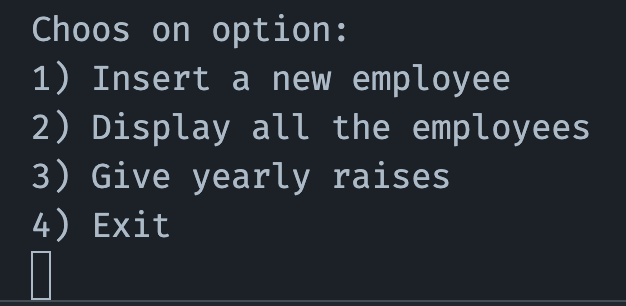
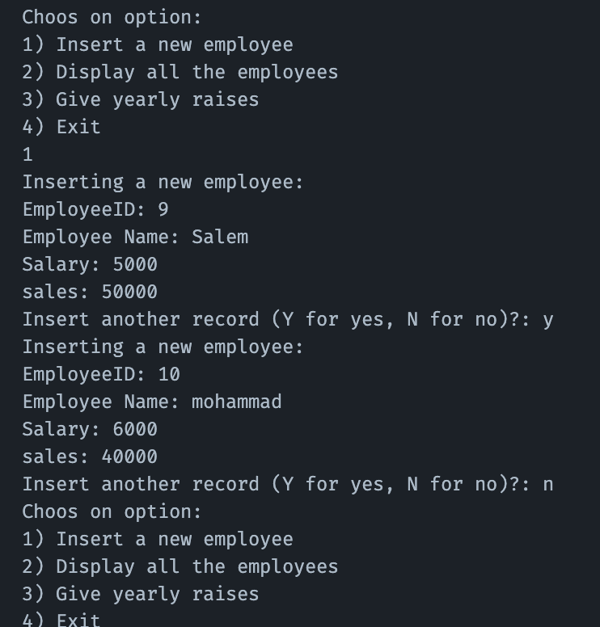
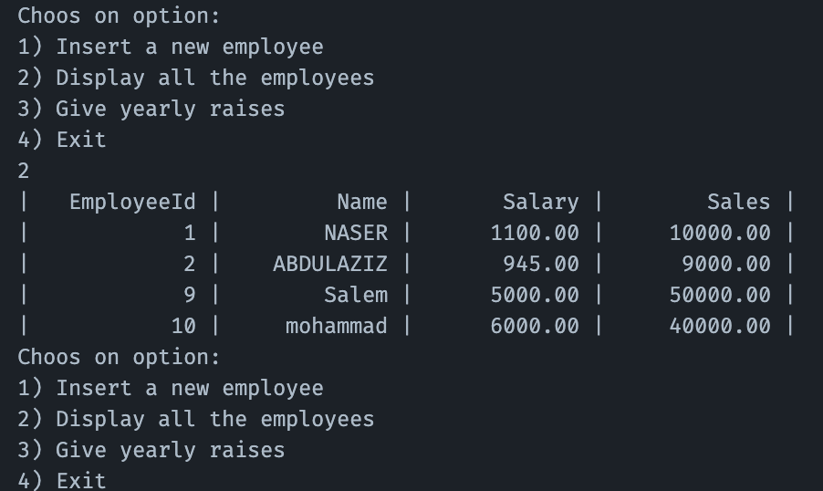
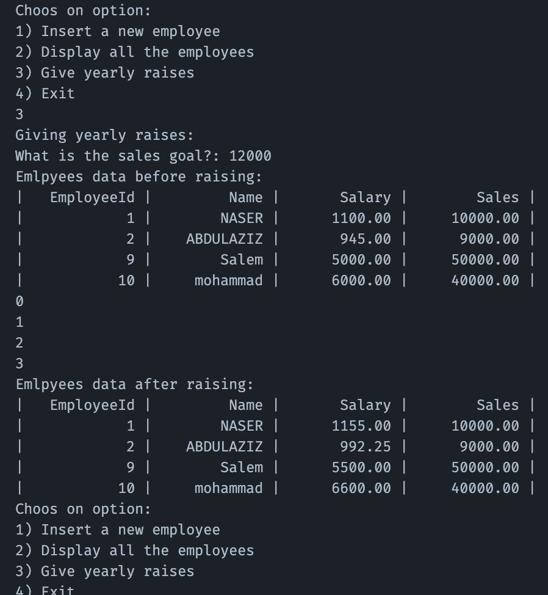

# IS230 Tutorial – Project Part II

JDBC (Java & Mariadb SQL)

## Project information
### Student
**Name:** Nasser Alowaymir

**ID:** 445102817

### Project requirments


<br/>

> [!WARNING]
> تنبيهات مهمة لا يعذر الطالب بعدم أخذها بعين الاعتبار مهما كان السبب:
> 1.	أي تشابه في المشاريع, و لو جزئي, يعرض الطالب لرصد صفر كدرجة للمشروع و تقرير لدكتور المادة مع إمكانية رفع التقرير لرئيس القسم.
> 2.	يتم تسليم تقرير المشروع على الـ Blackboard.
>  -	المشاريع المسلمة عن طريق البريد أو البريد الإلكتروني لن تقبل.
>3.	عدم التقيد بمتطلبات التقرير (المذكورة في قالب تقرير المشروع (Project Report Template)) سوف يعرض الطالب لخصم درجات.


</br>

---

## Project Implementaion
I made the project in the "clean code" way, that helps readibility and consistintly for code maintainence. According to that I made two Java classes:
1. DB.java

Here I made a database connection uttility that helps passing the SQL quereis easily without any JDBC stuffs disturbing. When making a new object of this class it makes a connection according to database's information provided via it's constructor. Then, when need to update/insert any rows use `update()` method passing sql command as String. And when need to query and displaying any data use `query()` method passing the sql command also, and this mehtod returns a `ResultSet` object which includes the return from the database.
2. App.java

The main application class, which includes the main method that runs the main menu of the app. I made a database object and used it in the whole code implementaion using the `DB.java` class'es methods and abilities. I tried to make the code reusable and more able to be implemented in an actual real life project.


### Code snippets
1. DB.java code

```java 
import java.sql.*;
public class DB {
    private Connection conn = null;
    private Statement stmt = null;
    private String url;
    private String user;
    private String pwd;

    public DB(String url, String user, String pwd) {
        this.url = url;
        this.user = user;
        this.pwd = pwd;
    }

    public Connection connect(){
        if(conn==null){
            try {
                conn = DriverManager.getConnection(url, user, pwd);
            } catch (SQLException e) {
                e.printStackTrace();
            }
            System.out.println("Successfully connected to database");
            return conn;
        }else return conn;
    }

    public Statement statement(){
        if(stmt==null){
            try {
                stmt = this.connect().createStatement();
            } catch (SQLException e) {
                e.printStackTrace();
            }
            return stmt;
        }else return stmt;
    }

    public boolean update(String sql){
        try{
            statement().executeUpdate(sql);
            return true;
        }catch(SQLException e){
            System.out.println("Error: "+e.getMessage());
            return false;
        }
    }

    public ResultSet query(String sql){
        try {
            return statement().executeQuery(sql);
        } catch (Exception e) {
            System.err.println("Error: "+e.getMessage());
            return null;
        }
    }

    public void close(){
        try {
            statement().close();
            connect().close();
        } catch (SQLException e) {
            e.printStackTrace();
        }
    }
    
    
}
```
2. main method code for INSERTION
```java
boolean isAdding = true;
while(isAdding){
    // Insert a new employee
    db.update("INSERT INTO "+table+" VALUES ("+newEmployeeCall()+")");
    System.out.print("Insert another record (Y for yes, N for no)?: ");
    String input = in.next();
    if(input.equals("Y")||input.equals("y") ) continue;
    else isAdding=false;
}
```
`newEmployeeCall()` Method code:
```java
public static String newEmployeeCall(){
    String[] res = new String[4];
    System.out.println("Inserting a new employee:");
    System.out.print("EmployeeID: ");
    res[0] = in.next();
    System.out.print("Employee Name: ");
    res[1] = in.next();
    System.out.print("Salary: ");
    res[2] = in.next();
    System.out.print("sales: ");
    res[3] = in.next();
    return res[0]+",'"+res[1]+"',"+res[2]+","+res[3];
}
```
3. main method code for DISPLAYING records

```java
public static void displayAllCall(){
    ResultSet result = db.query("SELECT * FROM "+table);
    try {
        System.out.printf("| %12s | %12s | %12s | %12s |%n","EmployeeId","Name", "Salary","Sales");
        while(result.next()){
            System.out.printf(
                "| %12d | %12s | %12.2f | %12.2f |%n",
                result.getInt("EmployeeId"),
                result.getString("Name"),
                result.getDouble("Salary"),
                result.getDouble("Sales")
            );
        }
    } catch (SQLException e) {
        e.printStackTrace();
    }
}
```

4. main method for INCREASING the salary (Give yearly raises)

```java
public static void yearlyRaisingCall(){
    System.out.println("Giving yearly raises: ");
    System.out.print("What is the sales goal?: ");
    double goal = in.nextDouble();
    System.out.println("Emlpyees data before raising:");
    displayAllCall();
    int employeesCount = 0;
    try {
        ResultSet res =db.query("SELECT COUNT(*) FROM "+ table);

        employeesCount = res.next() ? res.getInt(1) : 0;
    } catch (SQLException e) {
        e.printStackTrace();
    }
    int[] ids = new int[employeesCount];
    double[] salaries = new double[employeesCount];
    double[] sales = new double[employeesCount];
    ResultSet res = db.query("SELECT * FROM "+table);
    
    try {
        int i = 0;
        while(res.next()){
            ids[i] = res.getInt("EmployeeId");
            salaries[i]=res.getDouble("Salary");
            sales[i]=res.getDouble("Sales");
            // giving the rasing
            System.out.println(i);
            if (sales[i]>=goal) salaries[i] = salaries[i]+salaries[i]*0.1;
            else salaries[i] = salaries[i]+salaries[i]*0.05;
            i++;
        }
    } catch (SQLException e) {
        e.printStackTrace();
    }

    int i =0;
    for(int id: ids){
        db.update("UPDATE "+ table + " SET Salary = "+ salaries[i] + " WHERE EmployeeId = "+ id);
        i++;
    }
    System.out.println("Emlpyees data after raising:");
    displayAllCall();
}
```
### Screenshots of execution
1. Main menu



2. Adding Emlpoyee



3. Displaying all Employees



4. Adding yearly raising



---
### The full code:

#### DB.java

```java
import java.sql.*;
public class DB {
    private Connection conn = null;
    private Statement stmt = null;
    private String url;
    private String user;
    private String pwd;

    public DB(String url, String user, String pwd) {
        this.url = url;
        this.user = user;
        this.pwd = pwd;
    }

    public Connection connect(){
        if(conn==null){
            try {
                conn = DriverManager.getConnection(url, user, pwd);
            } catch (SQLException e) {
                e.printStackTrace();
            }
            System.out.println("Successfully connected to database");
            return conn;
        }else return conn;
    }

    public Statement statement(){
        if(stmt==null){
            try {
                stmt = this.connect().createStatement();
            } catch (SQLException e) {
                e.printStackTrace();
            }
            return stmt;
        }else return stmt;
    }

    public boolean update(String sql){
        try{
            statement().executeUpdate(sql);
            return true;
        }catch(SQLException e){
            System.out.println("Error: "+e.getMessage());
            return false;
        }
    }

    public ResultSet query(String sql){
        try {
            return statement().executeQuery(sql);
        } catch (Exception e) {
            System.err.println("Error: "+e.getMessage());
            return null;
        }
    }

    public void close(){
        try {
            statement().close();
            connect().close();
        } catch (SQLException e) {
            e.printStackTrace();
        }
    }
    
    
}
```

#### App.java

```java
import java.sql.ResultSet;
import java.sql.SQLException;
import java.util.Scanner;
public class App {
    // Scanner (Console input)
    static Scanner in = new Scanner(System.in);
    static String url = "jdbc:mariadb://localhost:3306/is_230_project";
    static String user = "root";
    static String pwd = "Naser-123";
    static String table = "EMPLOYEES";
    static DB db = new DB(url,user,pwd);
    public static void main(String[] args) {
        db.connect();
        db.statement();

        

        boolean isRunning = true;
        while(isRunning){
            System.out.println("Choos on option:");
            System.out.println("1) Insert a new employee\n" + 
                                "2) Display all the employees\n" +
                                "3) Give yearly raises\n" + 
                                "4) Exit");
            
            switch (in.nextInt()) {
                case 1:
                    boolean isAdding = true;
                    while(isAdding){
                        // Insert a new employee
                        db.update("INSERT INTO "+table+" VALUES ("+newEmployeeCall()+")");
                        System.out.print("Insert another record (Y for yes, N for no)?: ");
                        String input = in.next();
                        if(input.equals("Y")||input.equals("y") ) continue;
                        else isAdding=false;
                    }
                    break;
                case 2:
                    displayAllCall();
                    break;
                case 3:
                    yearlyRaisingCall();
                    break;
                case 4:
                    isRunning = false;
                    break;
                default:
                    throw new AssertionError();
            }
        }
        
    }
    public static String newEmployeeCall(){
        String[] res = new String[4];
        System.out.println("Inserting a new employee:");
        System.out.print("EmployeeID: ");
        res[0] = in.next();
        System.out.print("Employee Name: ");
        res[1] = in.next();
        System.out.print("Salary: ");
        res[2] = in.next();
        System.out.print("sales: ");
        res[3] = in.next();
        return res[0]+",'"+res[1]+"',"+res[2]+","+res[3];
    }
    public static void displayAllCall(){
        ResultSet result = db.query("SELECT * FROM "+table);
        try {
            System.out.printf("| %12s | %12s | %12s | %12s |%n","EmployeeId","Name", "Salary","Sales");
            while(result.next()){
                System.out.printf(
                    "| %12d | %12s | %12.2f | %12.2f |%n",
                    result.getInt("EmployeeId"),
                    result.getString("Name"),
                    result.getDouble("Salary"),
                    result.getDouble("Sales")
                );
            }
        } catch (SQLException e) {
            e.printStackTrace();
        }
    }

    public static void yearlyRaisingCall(){
        System.out.println("Giving yearly raises: ");
        System.out.print("What is the sales goal?: ");
        double goal = in.nextDouble();
        System.out.println("Emlpyees data before raising:");
        displayAllCall();
        int employeesCount = 0;
        try {
            ResultSet res =db.query("SELECT COUNT(*) FROM "+ table);

            employeesCount = res.next() ? res.getInt(1) : 0;
        } catch (SQLException e) {
            e.printStackTrace();
        }
        int[] ids = new int[employeesCount];
        double[] salaries = new double[employeesCount];
        double[] sales = new double[employeesCount];
        ResultSet res = db.query("SELECT * FROM "+table);
        
        try {
            int i = 0;
            while(res.next()){
                ids[i] = res.getInt("EmployeeId");
                salaries[i]=res.getDouble("Salary");
                sales[i]=res.getDouble("Sales");
                // giving the rasing
                System.out.println(i);
                if (sales[i]>=goal) salaries[i] = salaries[i]+salaries[i]*0.1;
                else salaries[i] = salaries[i]+salaries[i]*0.05;
                i++;
            }
        } catch (SQLException e) {
            e.printStackTrace();
        }

        int i =0;
        for(int id: ids){
            db.update("UPDATE "+ table + " SET Salary = "+ salaries[i] + " WHERE EmployeeId = "+ id);
            i++;
        }
        System.out.println("Emlpyees data after raising:");
        displayAllCall();
    }
}
```

Get the java project ZIP [here](https://github.com/naserowaimer/IS230/raw/refs/heads/main/phase2/JDBC_project.zip).

Finally, Find the full project in my github account, [here](https://github.com/naserowaimer/IS230)
****
